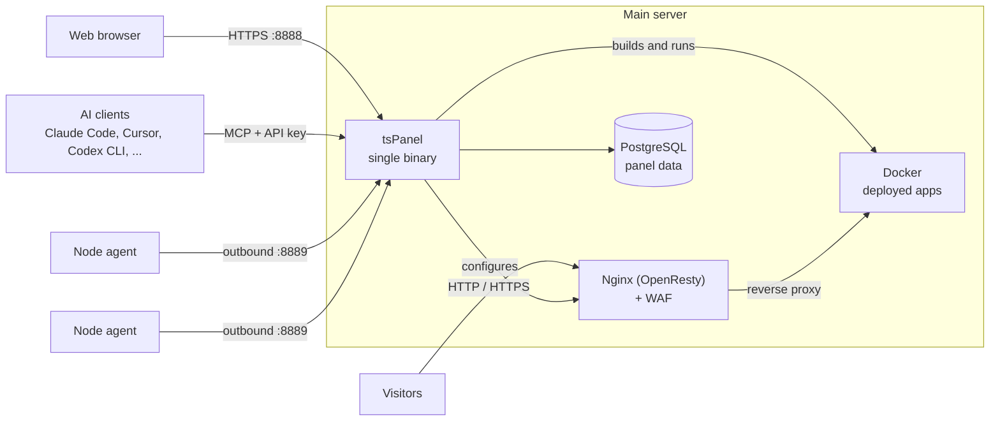

<div align="center">

# tsPanel

**Modern Linux server control panel for deploying, securing, and operating applications.**

[](https://github.com/techshield-tech/tsPanel/releases)
[](#system-requirements)
[](https://github.com/techshield-tech/tsPanel/stargazers)

English | [Tiếng Việt](README.vi.md)

</div>

<p align="center">
  <picture>
    <source media="(prefers-color-scheme: dark)" srcset="docs/images/84-dark-home.png">
    
  </picture>
</p>

<p align="center">
  <a href="#quick-start">Quick Start</a> ·
  <a href="docs/INSTALL.md">Installation Guide</a> ·
  <a href="docs/HUONG-DAN-SU-DUNG.md">User Guide</a> ·
  <a href="https://github.com/techshield-tech/tsPanel/releases">Releases</a>
</p>

## What is tsPanel?

tsPanel is a Linux server control panel for deploying, securing, and operating applications from a single web interface.

It brings application deployment, websites, Docker, databases, domains and SSL, a web application firewall, backups, monitoring, multi-server management, and AI-assisted operations into one place.

tsPanel ships as a single binary and installs with one command.

## Quick Start

Install tsPanel on a fresh Linux server:

```bash
curl -fsSL https://raw.githubusercontent.com/techshield-tech/tsPanel/main/install.sh | sudo bash
```

When it finishes, the installer prints the panel URL, the `admin` password, and the `Entrance` URL. **Save them now. They are shown only once.** Open the `Entrance` URL in your browser and sign in.

> [!WARNING]
> tsPanel is in **beta**. Try it on a fresh or non-production server before using it in production.

The panel uses a self-signed certificate at first, so your browser shows a warning on the first visit. On cloud servers, also open port `8888/TCP` in the provider's firewall or security group. More options are in the [Installation Guide](docs/INSTALL.md).

## Why tsPanel?

**One dashboard.** Manage applications, websites, databases, containers, domains, security, and server operations from one place.

**Simple deployment.** Deploy from a Git repository, a ZIP file, a directory on the server, or a Docker image. tsPanel builds the image, runs health checks, and routes your domain to the container.

**Built-in security.** Protect the panel with a private login URL, two-factor authentication, and audit logs. Protect your sites with a WAF based on Coraza and the OWASP Core Rule Set.

**AI-ready.** Connect AI coding agents through MCP so they can deploy, inspect, and roll back projects with scoped API keys.

**Multi-server.** Add more Linux servers as nodes. Each node runs an agent that connects back to the main panel, so nodes need no inbound ports.

## Key Features

### 🚀 Application Deployment

- Deploy from Git, ZIP upload, a server directory, or a Docker image
- Build from a `Dockerfile` or Compose file
- Automatic redeploy on Git push
- Health checks before traffic is routed
- Custom domains, automatic DNS records, and Let's Encrypt HTTPS
- Encrypted environment variables
- Build logs, runtime logs, deployment history, and rollback

### 🌐 Websites

- PHP and static sites
- Node.js, Python, and Go projects
- Reverse proxy sites
- All served by Nginx (OpenResty)

### 🐳 Docker

- Containers, images, Compose, networks, and volumes
- Private registries
- One-click apps (Adminer, MySQL, Nginx, PostgreSQL, Redis)
- Docker daemon configuration

### 🗄️ Databases

- MySQL / MariaDB, PostgreSQL, MongoDB, Redis, SQL Server
- Local and remote database servers

### 🔒 Domains & SSL

- DNS provider integration, such as Cloudflare
- DNS record management
- Let's Encrypt certificates, including wildcards
- Automatic renewal

### 🛡️ Security & WAF

- Coraza engine with the OWASP Core Rule Set
- Access control, rate limiting, and country blocking
- Custom rules
- Attack logs, traffic analytics, and an attack map

### 📊 Operations

- CPU, memory, load, disk I/O, and network monitoring
- Audit, panel, website, system, and SSH login logs
- Scheduled tasks, task workflows, and a script library
- Backups of websites, databases, and panel settings
- Alerts by Email, Telegram, or Webhook
- File manager, code editor, web terminal, and FTP

### 🖥️ Multi-server

- Manage many Linux servers from one panel
- Agents connect back to the main panel
- Install agents over SSH from the panel

### 🤖 AI / MCP

- Built-in MCP server
- Scoped API keys: permission level, projects, IP allowlist, expiry
- Works with Claude Code, Cursor, VS Code, Codex CLI, and other MCP clients

## AI-powered server operations

tsPanel includes an MCP ([Model Context Protocol](https://modelcontextprotocol.io)) server. Compatible AI agents can create, deploy, monitor, and roll back projects through it.

```text
Deploy the current directory to tsPanel as project "shop", container port 3000.
If the build fails, read the build log, fix it, and deploy again.
```

Each client uses its own API key, and the key decides what the agent can do:

| Permission | Allows |
| --- | --- |
| Read-only | View projects, deployment history, and logs |
| Deploy | Create and update projects, upload files, deploy, roll back, manage domains and environment variables. No deletes |
| Full access | Everything, including deletes |

Keys can also be limited to specific projects and IP addresses, and set to expire. The MCP server exposes 25 tools, including branch preview deployments.

**Compatible clients:** Claude Code, Claude Desktop, Cursor, VS Code, Windsurf, Codex CLI, Gemini CLI, and any client that supports MCP over streamable HTTP.

> [!NOTE]
> The MCP endpoint is protected by its API key only. The private login URL, panel IP allowlist, and Basic Auth protect the web interface, not the MCP endpoint.

<p align="center">
  
</p>

## Security

Security is part of the core panel, not an add-on.

**Panel access**

- Private login URL (`Entrance`)
- Two-factor authentication
- HTTP Basic Auth in front of the login page
- Login alerts and password expiry
- Custom HTTPS certificate for the panel
- Audit log of panel actions

**Supply chain**

- Releases are signed with ed25519. The installer verifies `SHA256SUMS` and its signature before installing.
- Software from the App Store is prebuilt and checked with SHA-256 and an ed25519 signature before it is installed.
- When upgrading, the installer backs up the panel database first and rolls back automatically if the new version fails to start.

### Built-in Web Application Firewall

The WAF uses the Coraza engine and the OWASP Core Rule Set, and runs with Nginx (OpenResty).

- Paranoia levels 1–4 and attack categories (SQLi, XSS, RCE, LFI/RFI, …)
- Allow and block lists by IP/CIDR, URL, User-Agent, and header
- Rate limiting with automatic IP blocking
- Country blocking
- Custom rules, evaluated before the OWASP CRS
- Attack logs, traffic analytics, attack map, and CSV reports

<p align="center">
  
</p>

## Screenshots

<table>
  <tr>
    <td width="50%"><br><sub>Deployment projects</sub></td>
    <td width="50%"><br><sub>Project overview</sub></td>
  </tr>
  <tr>
    <td><br><sub>Docker</sub></td>
    <td><br><sub>Databases</sub></td>
  </tr>
  <tr>
    <td><br><sub>DNS</sub></td>
    <td><br><sub>SSL certificates</sub></td>
  </tr>
  <tr>
    <td><br><sub>Monitoring</sub></td>
    <td><br><sub>Web terminal</sub></td>
  </tr>
</table>

More screenshots are in the [User Guide](docs/HUONG-DAN-SU-DUNG.md).

## Architecture



- **tsPanel** is one binary that serves the web interface, the API, and the MCP endpoint. It stores its own data in PostgreSQL.
- **Nginx (OpenResty)** serves websites and routes domains to deployed containers. The WAF runs in front of it.
- **Node agents** on other servers connect out to the main panel, so those servers need no open inbound ports.

## System Requirements

| Requirement | Supported |
| --- | --- |
| OS | Ubuntu 22.04 / 24.04, Debian 12, Rocky Linux 9, AlmaLinux 9 |
| Architecture | amd64 (`x86_64`), arm64 (`aarch64`) |
| Init system | systemd |
| Access | `root` or `sudo` |
| Memory | 1 GB minimum, 2 GB or more recommended |

Install tsPanel on a **fresh server**. Do not install it alongside aaPanel, BT Panel, or another panel that uses `/www`. The installer sets up PostgreSQL 14+ automatically.

## Installation

The [Installation Guide](docs/INSTALL.md) covers:

- [Installer options](docs/INSTALL.md#installer-options) and [installing a specific version](docs/INSTALL.md#install-a-specific-version)
- [Using an existing PostgreSQL server](docs/INSTALL.md#use-an-existing-postgresql-server)
- [Offline installation](docs/INSTALL.md#offline-installation)
- [Upgrading](docs/INSTALL.md#upgrade)
- [Admin commands](docs/INSTALL.md#admin-commands) and [file locations](docs/INSTALL.md#file-locations)
- [Troubleshooting](docs/INSTALL.md#troubleshooting)
- [Uninstalling](docs/INSTALL.md#uninstall)

## Documentation

- [Installation Guide](docs/INSTALL.md)
- [User Guide](docs/HUONG-DAN-SU-DUNG.md) (Vietnamese): every screen and feature, with screenshots
- [Releases](https://github.com/techshield-tech/tsPanel/releases)
- [Issues](https://github.com/techshield-tech/tsPanel/issues)

## Contributing

Bug reports, feature requests, and feedback are welcome. Please [open an issue](https://github.com/techshield-tech/tsPanel/issues).

This repository contains the installer, release metadata, and documentation. Fixes to the documentation are welcome as pull requests.

---

<p align="center">
  Built by <a href="https://techshield.vn">TechShield</a>
</p>
