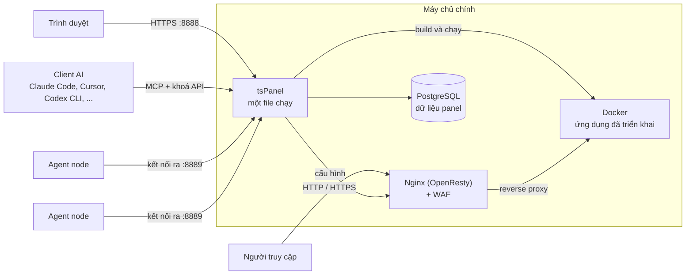

<div align="center">

# tsPanel

**Panel quản trị máy chủ Linux để triển khai, bảo vệ và vận hành ứng dụng.**

[](https://github.com/techshield-tech/tsPanel/releases)
[](#yêu-cầu-hệ-thống)
[](https://github.com/techshield-tech/tsPanel/stargazers)

[English](README.md) | Tiếng Việt

</div>

<p align="center">
  <picture>
    <source media="(prefers-color-scheme: dark)" srcset="docs/images/84-dark-home.png">
    
  </picture>
</p>

<p align="center">
  <a href="#cài-đặt-nhanh">Cài đặt nhanh</a> ·
  <a href="docs/HUONG-DAN-SU-DUNG.md">Hướng dẫn sử dụng</a> ·
  <a href="https://github.com/techshield-tech/tsPanel/releases">Bản phát hành</a>
</p>

## tsPanel là gì?

tsPanel là panel quản trị máy chủ Linux qua trình duyệt, dùng để triển khai, bảo vệ và vận hành ứng dụng từ một giao diện web.

Panel gom các chức năng triển khai ứng dụng, website, Docker, cơ sở dữ liệu, tên miền và SSL, tường lửa ứng dụng web, sao lưu, giám sát, quản lý nhiều máy chủ và vận hành bằng trợ lý AI vào một chỗ.

tsPanel được đóng gói trong một file chạy duy nhất và cài bằng một lệnh.

## Cài đặt nhanh

Cài tsPanel trên một máy chủ Linux mới:

```bash
curl -fsSL https://raw.githubusercontent.com/techshield-tech/tsPanel/main/install.sh | sudo bash
```

Khi cài xong, script in ra URL của panel, mật khẩu `admin` và URL `Entrance`. **Hãy lưu lại ngay, vì các thông tin này chỉ hiện một lần.** Mở URL `Entrance` trên trình duyệt và đăng nhập.

> [!WARNING]
> tsPanel đang ở giai đoạn **beta**. Hãy chạy thử trên máy chủ mới hoặc máy thử nghiệm trước khi dùng cho production.

Lúc đầu panel dùng chứng chỉ tự ký, nên trình duyệt sẽ cảnh báo ở lần truy cập đầu tiên. Với máy chủ cloud, cần mở thêm cổng `8888/TCP` trên firewall hoặc Security Group của nhà cung cấp. Các tuỳ chọn khác xem trong [Hướng dẫn sử dụng](docs/HUONG-DAN-SU-DUNG.md#2-cài-đặt).

## Vì sao chọn tsPanel?

**Một giao diện cho mọi thứ.** Quản lý ứng dụng, website, cơ sở dữ liệu, container, tên miền, bảo mật và vận hành máy chủ ở cùng một nơi.

**Triển khai đơn giản.** Triển khai từ repository Git, tệp ZIP, thư mục trên máy chủ hoặc Docker image. tsPanel build image, kiểm tra sức khoẻ ứng dụng rồi định tuyến tên miền tới container.

**Bảo mật có sẵn.** Bảo vệ panel bằng URL đăng nhập riêng, xác thực hai lớp và nhật ký kiểm toán. Bảo vệ website bằng WAF dựa trên Coraza và OWASP Core Rule Set.

**Sẵn sàng cho AI.** Kết nối trợ lý AI qua MCP để triển khai, kiểm tra và rollback dự án bằng khoá API có giới hạn quyền.

**Nhiều máy chủ.** Thêm máy chủ Linux khác làm node. Mỗi node chạy một agent tự kết nối về panel chính, nên node không cần mở cổng đầu vào.

## Tính năng chính

### 🚀 Triển khai ứng dụng

- Triển khai từ Git, tệp ZIP, thư mục trên máy chủ hoặc Docker image
- Build từ `Dockerfile` hoặc tệp Compose
- Tự triển khai lại khi có push lên Git
- Kiểm tra sức khoẻ trước khi chuyển lưu lượng
- Tên miền riêng, tự tạo bản ghi DNS, HTTPS Let's Encrypt
- Biến môi trường được lưu mã hoá
- Log build, log runtime, lịch sử triển khai và rollback

### 🌐 Website

- Website PHP và web tĩnh
- Dự án Node.js, Python, Go
- Website reverse proxy
- Tất cả chạy sau Nginx (OpenResty)

### 🐳 Docker

- Container, image, Compose, mạng, volume
- Registry riêng
- Ứng dụng một chạm (Adminer, MySQL, Nginx, PostgreSQL, Redis)
- Cấu hình Docker daemon

### 🗄️ Cơ sở dữ liệu

- MySQL / MariaDB, PostgreSQL, MongoDB, Redis, SQL Server
- Máy chủ cơ sở dữ liệu cục bộ và từ xa

### 🔒 Tên miền & SSL

- Kết nối nhà cung cấp DNS (Cloudflare, …)
- Quản lý bản ghi DNS
- Chứng chỉ Let's Encrypt, kể cả wildcard
- Tự gia hạn

### 🛡️ Bảo mật & WAF

- Engine Coraza với OWASP Core Rule Set
- Kiểm soát truy cập, giới hạn tốc độ, chặn theo quốc gia
- Quy tắc tuỳ chỉnh
- Nhật ký tấn công, phân tích lưu lượng, bản đồ tấn công

### 📊 Vận hành

- Giám sát CPU, bộ nhớ, tải hệ thống, IO ổ đĩa và mạng
- Nhật ký kiểm toán, log panel, log website, log hệ thống, log đăng nhập SSH
- Tác vụ định kỳ, luồng tác vụ và thư viện script
- Sao lưu website, cơ sở dữ liệu và cài đặt panel
- Cảnh báo qua Email, Telegram hoặc Webhook
- Trình quản lý tệp, trình soạn thảo, terminal web, FTP

### 🖥️ Nhiều máy chủ

- Quản lý nhiều máy chủ Linux từ một panel
- Agent tự kết nối về panel chính
- Cài agent qua SSH ngay từ panel

### 🤖 AI / MCP

- Máy chủ MCP tích hợp sẵn
- Khoá API giới hạn theo quyền, dự án, IP và thời hạn
- Dùng được với Claude Code, Cursor, VS Code, Codex CLI và các client MCP khác

## Vận hành máy chủ bằng AI

tsPanel có sẵn máy chủ MCP ([Model Context Protocol](https://modelcontextprotocol.io)). Các trợ lý AI tương thích có thể tạo, triển khai, theo dõi và rollback dự án thông qua máy chủ này.

```text
Triển khai thư mục hiện tại lên tsPanel thành dự án "shop", cổng container 3000.
Nếu build lỗi, đọc log build, sửa và triển khai lại.
```

Mỗi client dùng một khoá API riêng, và khoá quyết định trợ lý AI được làm gì:

| Quyền | Cho phép |
| --- | --- |
| Chỉ đọc | Xem dự án, lịch sử triển khai và log |
| Triển khai | Tạo và cập nhật dự án, tải tệp lên, triển khai, rollback, quản lý tên miền và biến môi trường. Không có quyền xoá |
| Toàn quyền | Mọi thao tác, kể cả xoá |

Khoá còn có thể giới hạn theo dự án, theo địa chỉ IP và có thời hạn. Máy chủ MCP cung cấp 25 công cụ, trong đó có bản xem trước theo nhánh Git.

**Client tương thích:** Claude Code, Claude Desktop, Cursor, VS Code, Windsurf, Codex CLI, Gemini CLI và mọi client hỗ trợ MCP qua streamable HTTP.

> [!NOTE]
> Endpoint MCP chỉ được bảo vệ bằng khoá API. URL đăng nhập riêng, danh sách IP được phép và Basic Auth chỉ bảo vệ giao diện web, không bảo vệ endpoint MCP.

<p align="center">
  
</p>

## Bảo mật

Bảo mật là một phần của panel, không phải tiện ích cài thêm.

**Truy cập panel**

- URL đăng nhập riêng (`Entrance`)
- Xác thực hai lớp
- HTTP Basic Auth trước trang đăng nhập
- Cảnh báo đăng nhập và hết hạn mật khẩu
- Chứng chỉ HTTPS riêng cho panel
- Nhật ký kiểm toán các thao tác trên panel

**Chuỗi cung ứng**

- Bản phát hành được ký bằng ed25519. Script cài đặt kiểm tra `SHA256SUMS` và chữ ký trước khi cài.
- Phần mềm trong Kho ứng dụng được dựng sẵn và được kiểm tra SHA-256 cùng chữ ký ed25519 trước khi cài.
- Khi nâng cấp bằng script cài đặt, database của panel được sao lưu trước, và script tự quay về bản cũ nếu bản mới không khởi động được.

### Tường lửa ứng dụng web tích hợp

WAF dùng engine Coraza và OWASP Core Rule Set, chạy cùng Nginx (OpenResty).

- Mức độ nghiêm ngặt 1–4 và nhóm tấn công (SQLi, XSS, RCE, LFI/RFI, …)
- Danh sách cho phép / chặn theo IP/CIDR, URL, User-Agent và header
- Giới hạn tốc độ, tự động chặn IP
- Chặn theo quốc gia
- Quy tắc tuỳ chỉnh, được xét trước OWASP CRS
- Nhật ký tấn công, phân tích lưu lượng, bản đồ tấn công, báo cáo xuất CSV

<p align="center">
  
</p>

## Ảnh chụp màn hình

<table>
  <tr>
    <td width="50%"><br><sub>Danh sách dự án triển khai</sub></td>
    <td width="50%"><br><sub>Chi tiết dự án</sub></td>
  </tr>
  <tr>
    <td><br><sub>Docker</sub></td>
    <td><br><sub>Cơ sở dữ liệu</sub></td>
  </tr>
  <tr>
    <td><br><sub>DNS</sub></td>
    <td><br><sub>Chứng chỉ SSL</sub></td>
  </tr>
  <tr>
    <td><br><sub>Giám sát</sub></td>
    <td><br><sub>Terminal web</sub></td>
  </tr>
</table>

Toàn bộ ảnh chụp màn hình có trong [Hướng dẫn sử dụng](docs/HUONG-DAN-SU-DUNG.md).

## Kiến trúc



- **tsPanel** là một file chạy, phục vụ giao diện web, API và endpoint MCP. Dữ liệu của panel lưu trong PostgreSQL.
- **Nginx (OpenResty)** phục vụ website và định tuyến tên miền tới container đã triển khai. WAF chạy phía trước.
- **Agent node** trên các máy chủ khác tự kết nối về panel chính, nên các máy chủ đó không cần mở cổng đầu vào.

## Yêu cầu hệ thống

| Mục | Hỗ trợ |
| --- | --- |
| Hệ điều hành | Ubuntu 22.04 / 24.04, Debian 12, Rocky Linux 9, AlmaLinux 9 |
| Kiến trúc | amd64 (`x86_64`), arm64 (`aarch64`) |
| Hệ thống init | systemd |
| Quyền | `root` hoặc `sudo` |
| Bộ nhớ | Tối thiểu 1 GB, nên có từ 2 GB |

Nên cài trên **máy chủ mới**. Không cài chung với aaPanel, BT Panel hay panel khác cũng dùng thư mục `/www`. Script cài đặt tự cài PostgreSQL 14 trở lên.

## Cài đặt

[Hướng dẫn sử dụng](docs/HUONG-DAN-SU-DUNG.md) có các phần:

- [Tuỳ chọn cài đặt nâng cao](docs/HUONG-DAN-SU-DUNG.md#25-tuỳ-chọn-cài-đặt-nâng-cao): cài phiên bản cụ thể, dùng PostgreSQL có sẵn, cài offline
- [Nâng cấp](docs/HUONG-DAN-SU-DUNG.md#20-nâng-cấp)
- [Lệnh quản trị](docs/HUONG-DAN-SU-DUNG.md#192-lệnh-quản-trị) và [vị trí file](docs/HUONG-DAN-SU-DUNG.md#193-vị-trí-file)
- [Xử lý sự cố](docs/HUONG-DAN-SU-DUNG.md#19-xử-lý-sự-cố)
- [Gỡ cài đặt](docs/HUONG-DAN-SU-DUNG.md#21-gỡ-cài-đặt)

## Tài liệu

- [Hướng dẫn sử dụng](docs/HUONG-DAN-SU-DUNG.md): mọi màn hình và chức năng, kèm ảnh chụp
- [Installation Guide](docs/INSTALL.md) (tiếng Anh)
- [Bản phát hành](https://github.com/techshield-tech/tsPanel/releases)
- [Báo lỗi / góp ý](https://github.com/techshield-tech/tsPanel/issues)

## Đóng góp

Rất hoan nghênh báo lỗi, đề xuất tính năng và góp ý. Hãy [tạo issue](https://github.com/techshield-tech/tsPanel/issues).

Repository này chứa script cài đặt, thông tin bản phát hành và tài liệu. Các bản sửa tài liệu có thể gửi qua pull request.

---

<p align="center">
  Phát triển bởi <a href="https://techshield.vn">TechShield</a>
</p>
